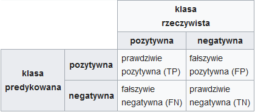
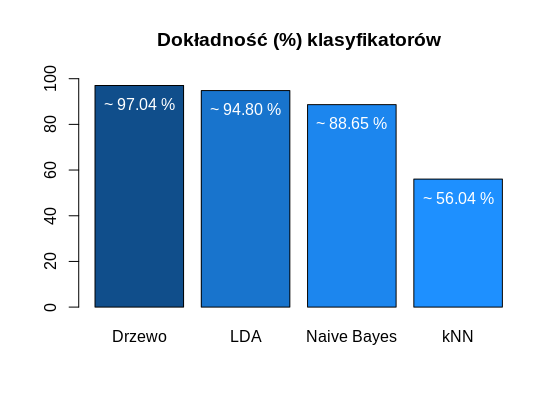
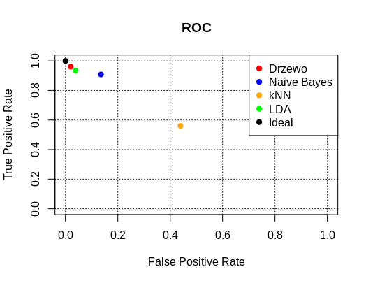
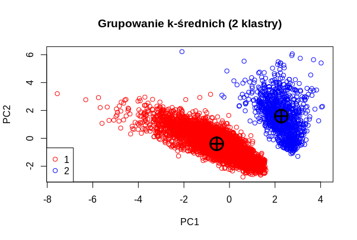
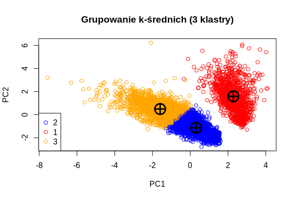
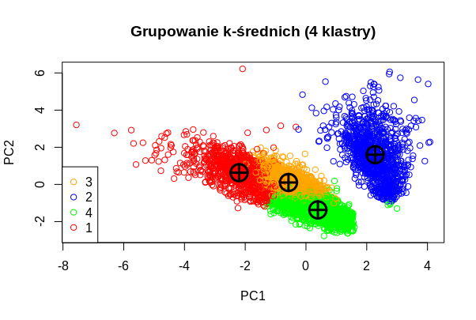
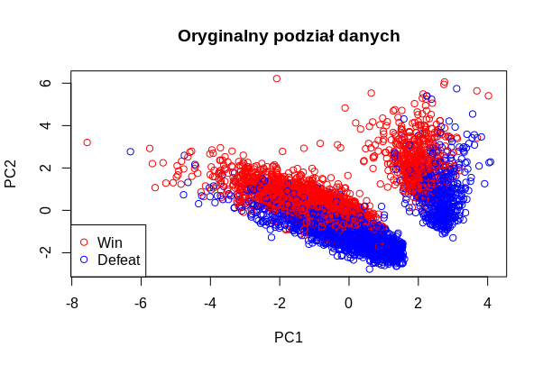

```{r setup, include=FALSE}
knitr::opts_chunk$set(echo = TRUE)
```
### <b>1. Wstęp</b>
Celem zadania było przećwiczenie poznanych na laboratoriach technik zgłębiania danych na wybranym zbiorze danych (najlepiej z kolumną „class” z dwoma możliwymi wartościami). 

#### <b>1.1. Baza danych</b>
Do realizacji zadania wybrano bazę danych dotyczącą popularnej gry MMORPG - „World of Warcraft” o nazwie *World of Warcraft Battlegrounds*, która zestawia statystyki graczy uczestniczących w Polach Bitew (ang. *Battlegrounds*). Pole Bitwy to obszar wyłączony fabularnie z gry; jest to miejsce gdzie dwie wrogie frakcje - *Horda* i *Przymierze* - mogą walczyć ze sobą w ograniczonym świecie. Baza danych została stworzona przez Carlosa Blesa i jest dostępna [tutaj](https://www.kaggle.com/cblesa/world-of-warcraft-battlegrounds).

Baza danych składa się z 5383 wierszy i 14 kolumn:

* <b>*Battleground*</b> - nazwa własna Pola Bitwy,
* <b>*Code*</b> - numer porządkowy instancji Pola Bitwy,
* <b>*Faction*</b> - frakcja gracza - "Horde" lub "Alliance",
* <b>*Class*</b> - klasa postaci gracza np. "Hunter",
* <b>*KB (Killing Blows)*</b> - liczba zabójstw gracza,
* <b>*D (Deaths)*</b> - liczba śmierci gracza,
* <b>*HK (Honorable Kills)*</b> - liczba asyst gracza podczas zabójstw dokonanych przez jego zespół,
* <b>*DD (Damage Done)*</b> - ilość zadanych obrażeń,
* <b>*HD (Healing Done)*</b> - wielkość zadanego leczenia,
* <b>*Honor*</b> - liczba punktów honoru, które gracz dostaje po rozgrywce,
* <b>*Win*</b> i <b>*Lose*</b> - kolumny zawierające dane mówiące o tym, czy gracz wygrał, czy przegrał (1 w komórce potwierdza prawdziwość tezy z nagłówka (komórka w opozycyjnej kolumnie jest wtedy pusta)),
* <b>*Role*</b> - rola gracza w rozgrywce - *dps* lub *heal(er)*,
* <b>*BE (Bonus Event)*</b> - kolumna mówiąca o tym, czy dany gracz brał udział w rozgrywce podczas specjalnego wydarzenia w grze (1 oznacza, że tak, pusta komórka oznacza, że nie).

#### <b>1.2. Wybór klasy</b>
Klasa powinna być wyrażona binarnie, np 0/1, True/False, Yes/No. Obecnie w bazie danych nie istniała kolumna, która mogłaby być użyta jako klasa. Potrzebna była wstępna obróbka danych. Kolumna <b>*Win*</b> została zmieniona na <b>*Result*</b> o typie *character* i w sposób iteracyjny zamieniono puste pola na *Defeat*, zaś pola z jedynką na <b>*Win*</b>. Na końcu zamieniono typ kolumny <b>*Result*</b> na typ *factor*.

```
#Zmiana kolumny Result na typ character
data$Result <- sapply(data$Result, as.character)
#Iteracja przez każdy element w zbiorze danych
for(i in (1:nrow(data))) {
  if(is.na(data$Result[i])) {
    data$Result[i] <- "Defeat"
  } else {
    data$Result[i] <- "Win"
  }
}
#Zmiana kolumny Result na typ factor
data$Result <- sapply(data$Result, as.factor)
```

#### <b>1.3. Cel</b>
Celem projektu jest uzyskanie odpowiedzi na pytania:

* Jaki wpływ na wygraną lub przegraną mają statystyki/cechy postaci gracza?
* Czy istnieje przybliżony zestaw parametrów determinujący wygraną?

***

### <b>2. Przetwarzanie i obróbka danych</b>
#### <b>2.1. Wybór kolumn</b>
Niektóre kolumny były nieistotne do ogólnej analizy; pominięto wczytanie kolumn:

* <b>*Battleground*</b> - nie ma znaczenia z jakiego typu Pola Bitwy dane zostały pobrane, gdyż każda bitwa ma limit czasowy w postaci kilkunastu minut,
* <b>*Code*</b> - podobnie jak wyżej - nie ma znaczenia z jakiej konkretnej instancji konkretnego typu Pola Bitwy dane zostałe pobrane,
* <b>*Lose*</b> - kolumna <b>*Win*</b> jest wystarczająca (pkt. 1.2); usuwamy redundancję,
* <b>*BE (Bonus Event)*</b> - ilość niepustych wartości w kolumnie jest mała (ok. 100); nie wpływa znacznie na zdobywaną ilość honoru przez gracza (ok. 1-2%).

```
#Wczytanie z pliku .csv z wyborem kolumn (i ich kolejności)
data <- read.csv(data.location)[c(3,4,5,6,7,8,9,10,13,11)]
```

#### <b>2.2. Modyfikacja wartości w kolumnach</b>

Aby korzystać z klasyfikatorów, należało zmienić wszystkie kolumny (oprócz klasowej) na typ *numeric* (lub *bool*). Skopiowano nieodpowiednie kolumny rzutując je na *numeric*. Następnie za pomocą funkcji *correctWithRules* (paczka *deducorrect*) oraz odpowiedniego pliku z określonymi zasadami dot. poprawy danych (tzw. plik *correction rules*), skopiowane komórki kolumny zostały uzupełnione o numery porządkowe które w jednoznaczy sposób określały ciąg znaków znajdujący się w komórkach kolumn oryginalnych (np. klasę postaci *Warrior* skojarzono z numerem *0*).

Mdyfikacja kolumny <b>*Faction*</b>:

```
...
#Tworzymy kopię kolumny zrzutowanej na typ numeric
data$Faction_as_int <- sapply(data$Faction, as.numeric)
#Correction rules wczytuje zasady z pliku
cr <-correctionRules(rules.location)
#Zapisujemy dane po poprawkach
data <- correctWithRules(cr, data)$corrected
...
#Zamieniamy zawartość kolumny na liczbową
data$Faction <- data$Faction_as_int
#Skopiowane kolumny zostają pominięte
data <- data[,1:10]
```
W sposób analogiczny wykonano operacje dla kolumn <b>*Class*</b> i <b>*Role*</b>.

Przykładowe zasady z pliku *correction rules*:
```
...
if(Faction == "Horde") {
  Faction_as_int <- 1
}
if (Character_class == "Warrior") {
  Class_as_int <- 0
}
...
```

***

### <b>3. Klasyfikatory</b>
#### <b>3.1. Zbiór testowy i treningowy</b>
Dane zostały podzielona na:

* <b>dane treningowe</b> – wykorzystane do uczenia klasyfikatora,
* <b>dane testowe</b> – wykorzystane do oceny klasyfikatora.

Ze względu na klasyfikator <b>*kNN*</b> stworzono kopię danych znormalizowanych; je również podzielono: 
```
#Podzial na dane testowe i treningowe
set.seed(rng)
ind <- sample(2, nrow(data), replace=TRUE, prob=c(0.67, 0.33))
#Zwykłe :
data.training <- data[ind==1,] 
data.test <-data[ind==2,]
#Znormalizowane :
data.norm <- normalize(data[1:9])
data.norm <- cbind(data.norm, data[10])
data.norm.training <- data.norm[ind==1,]
data.norm.test <- data.norm[ind==2,]
#Faktyczne wartości klas z danych testowych
real <- data.test[,10]
```

#### <b>3.2. Testowanie klasyfikatorów</b>
Do testów użyto czterech klasyfikatorów:

* <b>drzewa decyzyjne</b>,
* <b>algorytm Naive-Bayes</b>,
* <b>k najbliższych sąsiadów (kNN)</b>, 
* <b>liniowa analiza dyskryminacyjna (LDA)</b>.

```
#Klasyfikatory
#Drzewo (paczka "party")
data.ctree <-ctree(Result ~ ., data=data.training)
predicted_tree <- predict(data.ctree, data.test[,1:9])
cm_tree <- table(predicted_tree,real)
accuracy_tree <- sum(diag(cm_tree))/sum(cm_tree)

#Naive Bayes (paczka "e1071")
data.model <-naiveBayes(Result ~ ., data=data.training)
predicted_nb <- predict(data.model, data.test[,1:9])
cm_nb <- table(predicted_nb,real)
accuracy_nb <- sum(diag(cm_nb))/sum(cm_nb)

#kNN (paczka "class")
knn.3 <-knn(data.norm.training[,1:9], data.norm.test[,1:9], cl=data.norm.training[,10],
k = 3, prob=FALSE)
predicted_knn <- knn.3
cm_knn <- table(predicted_knn,real)
accuracy_knn <- sum(diag(cm_knn))/sum(cm_knn)

#LDA (paczka "MASS")
lda <- lda(Result ~ ., data=data.training)
predicted_lda <- predict(lda, data.test[,1:9])$class
cm_lda <- table(predicted_lda, real)
accuracy_lda <- sum(diag(cm_lda))/sum(cm_lda)
```

Wylosowano:

|ilość danych treningowych|ilość danych testowych|
|-------------------------|--------------------|
|3595                     |1788                |

#### <b>3.3. Macierz błędów i rodzaje błędów</b>
Macierz stosowana do oceny jakości klasyfikacji. Ma dwa wiersze i dwie kolumny; jest postaci:



Używając macierzy błędów dla rozpatrywanych danych można wyliczyć następujące wartości:

* <b>TP</b> (True Positive) – ilość rekordów poprawnie zaklasyfikowanych jako wygrana,
* <b>FP</b> (False Positive) – ilość rekordów fałszywie zaklasyfikowanych jako wygrana,
* <b>TN</b> (True Negative) – ilość rekordów poprawnie zaklasyfikowanych jako przegrana,
* <b>FN</b> (False Negaive) – ilość rekordów fałszywie zaklasyfikowanych jako przegrana.

Z powyższych danych można obliczyć:

* <b>TPR</b> (True Positive Rate) – odsetek prawdziwie pozytywnych (tzw. czułość),
```
TPR = TP/(TP + FN)
```
* <b>FPR</b> (False Positive Rate) – odsetek fałszywie pozytywnych,
```
FPR = FP/(FP + TN)
```
* <b>TNR</b> (True Negative Rate) – odsetek prawdziwie negatywnych (tzw. swoistość),
```
TNR = TN/(TN + FP)
```
* <b>FNR</b> (False Negative Rate) – odsetek fałszywie negatywnych.
```
FNR = FN/(FN + TP)
```

Dodatkowo:

* zwiększenie FP (błędu pierwszego rodzaju) zwiększa FPR oraz zmniejsza TNR,
* zwiększenie FN (błędu drugiego rodzaju) zwiększa FNR oraz zmniejsza TPR.

##### <b>Błąd pierwszego rodzaju (FP):</b>

Błąd polegający na odrzuceniu hipotezy zerowej, która w rzeczywistości nie jest fałszywa.
W kontekście badanej bazy danych jest to zestaw statystyk błędnie uznanych jako wygrana.

##### <b>Błąd drugiego rodzaju (FN):</b>

Błąd polegający na nieodrzuceniu hipotezy zerowej, która w rzeczywistości jest fałszywa.
W kontekście badanej bazy danych jest to zestaw statystyk błędnie uznanych jako przegrana.

##### <b>Istotność błędów pierwszego i drugiego rodzaju w projekcie:</b>

W kontekście badanej bazy danych gorszym do popełnienia jest błąd pierwszego rodzaju.
Celem badania bazy jest znaleznienie odpowiedzi na pytanie, czy (i jaki) zestaw statystyk determinuje wygraną. Błędne uznanie, że jakiś zestaw statystyk X determinuje wygraną i dodanie go do zbioru (popełnienie błędu pierwszego rodzaju) powoduje obniżenie średniego pożądanego poziomu umiejętności gracza, a w konsekwencji uniemożliwia podanie poprawnej odpowiedzi na zadawane pytanie.

(Popełnienie błędu drugiego rodzaju wiązałoby się z niesłusznym umieszzczeniem dobrego zestawu statystyk Y w zbiorze wartości nie zapewniających wygranej, a zatem "odjęcie" ich ze zbioru, który pozwala na określenie średniego pożądanego poziomu gracza. Jest to co prawda utrata danych, jednak ze względu na wielkość bazy danych można ją zignorować.)


#### <b>3.4. Wyniki klasyfikatorów</b>
##### <b>3.4.1. Drzewa decyzyjne</b>

|                  |              | real       |               |
|------------------|--------------|------------|---------------|
|                  |              | <b>Win</b> | <b>Defeat</b> |
| <b>predicted</b> | <b>Win</b>   | 861        | 18            |
|                  | <b>Defeat</b>| 35         | 874           |
```
TPR = 0.9609375
FPR = 0.02017937
```
</br>

##### <b>3.4.2. Naive-Bayes</b>

|                  |              | real       |               |
|------------------|--------------|------------|---------------|
|                  |              | <b>Win</b> | <b>Defeat</b> |
| <b>predicted</b> | <b>Win</b>   | 814        | 121           |
|                  | <b>Defeat</b>| 82         | 771           |
```
TPR = 0.9084821
FPR = 0.13565022
```
</br>

##### <b>3.4.3. kNN</b>

|                  |              | real       |               |
|------------------|--------------|------------|---------------|
|                  |              | <b>Win</b> | <b>Defeat</b> |
| <b>predicted</b> | <b>Win</b>   | 502        | 392           |
|                  | <b>Defeat</b>| 394        | 500           |
```
TPR = 0.5602679
FPR = 0.43946188
```
</br>

##### <b>3.4.4. LDA</b>

|                  |              | real       |               |
|------------------|--------------|------------|---------------|
|                  |              | <b>Win</b> | <b>Defeat</b> |
| <b>predicted</b> | <b>Win</b>   | 838        | 35            |
|                  | <b>Defeat</b>| 58         | 857           |
```
TPR = 0.9352679
FPR = 0.03923767
```
</br>

##### <b>3.4.5. Ocena klasyfikatorów</b>





##### <b>Wnioski</b>
Idealny klasyfikator leżałby w punkcie (1,0), ponieważ miałby wtedy najwyższy możliwy TPR, a najmniejszy FPR. Najbliżej punktu idealnego znajduje się klasyfikator drzewa. Klasyfikator ten popełnia również najmniej błędów pierwszego rodzaju, co w przypadku analizy danych z bazy *World of Warcraft Battlegrounds* jest najistotniejsze.

***

### <b>4. Grupowanie metodą k-średnich</b>

Postanowiono podzielić dane na 2,3 i 4 grupy (klastry):
```
data.stand <- scale(data[,1:9], center=TRUE)
data.pca <- prcomp(data.stand)
data.kmeans <- predict(data.pca)
#Grupujemy wszystkie rekordy na 2,3 i 4 klastry :
km_2 <- kmeans(data.kmeans, 2, iter.max = 100, algorithm = c("Lloyd"), trace=FALSE)
km_3 <- kmeans(data.kmeans, 3, iter.max = 100, algorithm = c("Lloyd"), trace=FALSE)
km_4 <- kmeans(data.kmeans, 4, iter.max = 100, algorithm = c("Lloyd"), trace=FALSE)
```
Następnie, za pomocą pomocniczej funkcji określono ilość i typy elementów znajdujących się w klastrach:
```
clusterInfo <- function(cluster, data) {
  #Obliczamy ilosc klastrow
  n <- length(unique(cluster))
  #Tworzymy trzy wektory numeryczne o dlugosci odpowiadajacej ilosci klastrow
  count_of_elements <- vector(mode="numeric", length=n) #wszystkie elementy klastra
  win <- vector(mode="numeric", length=n) #ilosc elementow z wartoscia wygranej
  defeat <- vector(mode="numeric", length=n) #ilosc elementow z wartoscia przegranej
  #Dla kazdego wiersza danych
  for(i in 1:nrow(data)) {
    #Dla kazdego klastra
    for(j in 1:n) {
      #Jesli wiersz i jest w klastrze j
      if (cluster[i] == j) {
        #Dodaj +1 do j'tego miejsca - licznika wszystkich elementow klastra j
        count_of_elements[j] <- count_of_elements[j] + 1
        #Dodaj +1 do j'tego miejsca w wektorze w win...
        if(data$Result[i] == "Win") 
          win[j] <- win[j] + 1
        #... lub defeat.
        else 
          defeat[j] <-defeat[j] + 1
      }
    }
  }
  return (data.frame(count_of_elements,win,defeat))
}
```
Wyniki przedstawiono na wykresach i w tabelach poniżej:



|Numer klastra |Ilość elementów   |Ilośc elementów "Win" |Ilość elementów "Defeat" |
|--------------|------------------|----------------------|-------------------------|
| 1            | 4318             | 2175                 | 2143                    |
| 2            | 1065             | 548                  | 517                     |




|Numer klastra |Ilość elementów   |Ilośc elementów "Win" |Ilość elementów "Defeat" |
|--------------|------------------|----------------------|-------------------------|
| 1            | 1063             | 546                  | 517                     |
| 2            | 2340             | 607                  | 1733                    |
| 3            | 1980             | 1570                 | 410                     |




|Numer klastra |Ilość elementów   |Ilośc elementów "Win" |Ilość elementów "Defeat" |
|--------------|------------------|----------------------|-------------------------|
| 1            | 1034             | 726                  | 308                     |
| 2            | 1058             | 546                  | 512                     |
| 3            | 1474             | 1309                 | 165                     |
| 4            | 1817             | 142                  | 1675                    |




##### <b>Wnioski</b>

Już w przypadku próby podziału danych na dwa klastry (*Rysunek 3*) w zestawieniu z tabelą (znajdującą się tuż pod nim) można zauważyć, że algorytm grupowania metodą k-średnich nie jest skuteczny w przypadku badanej bazy danych. Oba klastry zawierają po około 50% rekordów przypisanych do każdej z dwóch podklas (podobnie jak w przypadku danych oryginalnych (*Rysunek 6*)), co udowadnia, że algorytm *kmeans* dla *World of Warcraft Battlegrounds* jest wysoce nieefektywny.

Dalsze badanie następnych grupowań danych (za pomocą 3 i 4 klastrów) wykazało podobne "mieszanie się" rekordów w poszczególnych klastrach.

***

### <b>5. Reguły asocjacyjne</b>
#### <b>5.1. Ponowna obróbka danych</b>
Do zastosowania reguł asocjacyjnych wymagana była ponowna obróbka danych (zrzutowanie wszyskich typów kolumn na typ *factor*). Dodatkowo, z uwagi na zmienny, dynamiczny charakter gry (MMORPG, w których co uaktualnienie zmieniany jest balans gry, a co za tym idzie, średnie wartości liczbowe poszczególnych statystyk gracza możliwe do osiągnięcia i podtrzymania przez cały dodatek), postanowiono zamienić statystyki liczbowe na opisy słowne, określające stosunek do średniej w kolumnie. Dlatego: 

* Wykorzystano skopiowane dane przed wykonaniem punktu 2.2.,
```
#Kopia danych po obróbce kolumny klasy (przed correctionRules)
data.raw <- data
```
* Wyliczono średnie wartości kolumn numerycznych (tam gdzie miało to sens),
```
Killing_blows_avg <- mean(data.raw$Killing_blows)
Deaths_avg <- mean(data.raw$Deaths)
Honorable_kills_avg <- mean(data.raw$Honorable_kills)
Damage_done_avg <- mean(data.raw$Damage_done)
Healing_done_avg <- mean(data.raw$Healing_done)
Honor_avg <- mean(data.raw$Honor)
```
* Skopiowano kolumny numeryczne, oraz kolumnę klasy postaci, i zrzutowano na typ *character*,
```
data.raw$Killing_blows_tmp <- sapply(data.raw$Killing_blows, as.character)
data.raw$Deaths_tmp <- sapply(data.raw$Deaths, as.character)
data.raw$Honorable_kills_tmp <- sapply(data.raw$Honorable_kills, as.character)
data.raw$Damage_done_tmp <- sapply(data.raw$Damage_done, as.character)
data.raw$Healing_done_tmp <- sapply(data.raw$Healing_done, as.character)
data.raw$Honor_tmp <- sapply(data.raw$Honor, as.character)
data.raw$Character_class_tmp <- sapply(data.raw$Character_class, as.character)
```
* Napisano funkcję przypisującą wartości "Above average" lub "Below average" w zależności od liczby w komórce,
```
belowOrAboveAverage <- function(x, avg) {
  if (x >= avg) { return ("Above average") } 
  else { return ("Below average") }
}
```
* Napisano funkcję przypisującą klasom postaci jeden z trzech archetypów (stylów gry),
```
distinguishMeleeFromRanged <- function(x) {
  if (x %in% c("Warrior", "Paladin", "Rogue", "Monk", "Demon Hunter", "Death Knight")) { return ("Melee") } 
  else if (x %in% c("Hunter", "Priest", "Mage", "Warlock")) { return ("Ranged") }     
  else { return ("Versatile") }
}
```
* W sposób iteracyjny, wykorzystując powyższe funkcje, obliczono wartości pól w skopiowanych kolumnach,
```
for(i in 1:nrow(data.raw)) {
  data.raw$Killing_blows_tmp[i] <- belowOrAboveAverage(data.raw$Killing_blows[i], Killing_blows_avg)
  data.raw$Deaths_tmp[i] <- belowOrAboveAverage(data.raw$Deaths[i], Deaths_avg)
  data.raw$Honorable_kills_tmp[i] <- belowOrAboveAverage(data.raw$Honorable_kills[i], Honorable_kills_avg)
  data.raw$Damage_done_tmp[i] <- belowOrAboveAverage(data.raw$Damage_done[i], Damage_done_avg)
  data.raw$Healing_done_tmp[i] <- belowOrAboveAverage(data.raw$Healing_done[i], Healing_done_avg)
  data.raw$Honor_tmp[i] <- belowOrAboveAverage(data.raw$Honor[i], Honor_avg)
  data.raw$Character_class_tmp[i] <- distinguishMeleeFromRanged(data.raw$Character_class[i])
}
```
* Przepisano kolumny skopiowane do oryginalnych kolumn, rzutując ich typy na *factor*,
```
data.raw$Killing_blows <- sapply(data.raw$Killing_blows_tmp, as.factor)
data.raw$Deaths <- sapply(data.raw$Deaths_tmp, as.factor)
data.raw$Honorable_kills <- sapply(data.raw$Honorable_kills_tmp, as.factor)
data.raw$Damage_done <- sapply(data.raw$Damage_done_tmp, as.factor)
data.raw$Healing_done <- sapply(data.raw$Healing_done_tmp, as.factor)
data.raw$Honor <- sapply(data.raw$Honor_tmp, as.factor)
data.raw$Character_class <- sapply(data.raw$Character_class_tmp, as.factor)
data.raw$Faction <- sapply(data.raw$Faction, as.factor)
```
* Przycięto dane, pozbywając się skopiowanych kolumn.
```
data.raw <- data.raw[,1:10]
```
</br>

#### <b>5.2. Generacja reguł asocjacyjnych</b>

Mając na uwadze wartości średnie kolumn numerycznych:

|Killing_blows average |Deaths average |Honorable_kills average |Damage_done average |Healing_done average| Honor average|
|----------------------|---------------|------------------------|--------------------|--------------------|--------------|
| ~3.03|~3.05|~26.72|43880.84|28290.27|413.10|

Dla poprawionych danych wygenerowano reguły asocjacyjne:
```
rules <- apriori(data.raw ,parameter = list(minlen=2, supp=0.005, conf=0.8),
                 appearance = list(rhs=c("Result=Win", "Result=Defeat"),default="lhs"),
                 control = list(verbose=F))
rules.sorted <- sort(rules, by="lift") #7292 rules
#Eliminacja reguł redundantnych
subset.matrix <- is.subset(rules.sorted, rules.sorted)
subset.matrix[lower.tri(subset.matrix, diag=T)] <- FALSE
redundant <- colSums(subset.matrix, na.rm=T) >= 1
which(redundant)
rules.pruned <- rules.sorted[!redundant]
rules.pruned <- sort(rules.pruned, by="lift")
inspect(rules.pruned)
```

#### <b>5.3. Analiza wygenerowanych reguł asocjacyjnych</b>

Uzyskano 677 reguł. Spośród nich wybrano jedynie te, które implikowały wygraną Pola Bitwy (322 reguły). 

```
#Wybranie reguł implikującyh zwycięstwo
rules.win <- subset(rules.pruned, (rhs %in% paste0("Result=Win")))
inspect(rules.win)
```


Poniżej przedstawiono pierwsze 20 reguł asocjacyjnych o najwyższym priorytecie:
```
[1] {Faction=Horde,Character_class=Melee,Honor=Above average,Role=heal} => {Result=Win}
[2] {Faction=Horde,Character_class=Versatile,Killing_blows=Above average,Honor=Above average} => {Result=Win}
[3] {Faction=Horde,Character_class=Versatile,Damage_done=Above average,Honor=Above average} => {Result=Win}
[4] {Faction=Horde,Character_class=Versatile,Honor=Above average,Role=dps} => {Result=Win}
[5] {Faction=Horde,Killing_blows=Above average,Honorable_kills=Below average,Honor=Above average} => {Result=Win}
[6] {Killing_blows=Above average,Deaths=Below average,Damage_done=Below average,Honor=Above average} => {Result=Win}
[7] {Faction=Horde,Honorable_kills=Below average,Damage_done=Above average,Honor=Above average} => {Result=Win}
[8] {Faction=Horde,Character_class=Ranged,Honorable_kills=Above average,Honor=Above average,Role=heal} => {Result=Win}
[9] {Faction=Horde,Deaths=Below average,Honorable_kills=Above average,Honor=Above average,Role=heal} => {Result=Win}
[10] {Faction=Horde,Character_class=Versatile,Honorable_kills=Below average,Healing_done=Above average,Honor=Above average} => {Result=Win}
[11] {Faction=Horde,Character_class=Versatile,Deaths=Below average,Healing_done=Above average,Honor=Above average} => {Result=Win}
[12] {Faction=Horde,Character_class=Versatile,Deaths=Above average,Healing_done=Below average,Honor=Above average} => {Result=Win}
[13] {Faction=Horde,Character_class=Versatile,Deaths=Below average,Honorable_kills=Above average,Honor=Above average} => {Result=Win}
[14] {Faction=Horde,Character_class=Versatile,Honorable_kills=Above average,Healing_done=Below average,Honor=Above average} => {Result=Win}
[15] {Faction=Horde,Deaths=Above average,Honorable_kills=Below average,Healing_done=Above average,Honor=Above average} => {Result=Win}
[16] {Faction=Horde,Killing_blows=Below average,Damage_done=Above average,Healing_done=Above average,Honor=Above average} => {Result=Win}
[17] {Faction=Horde,Character_class=Melee,Damage_done=Below average,Healing_done=Above average,Honor=Above average} => {Result=Win}
[18] {Faction=Horde,Character_class=Melee,Deaths=Below average,Healing_done=Above average,Honor=Above average} => {Result=Win}
[19] {Faction=Horde,Character_class=Melee,Killing_blows=Below average,Healing_done=Above average,Honor=Above average} => {Result=Win}
[20] {Character_class=Melee,Killing_blows=Below average,Healing_done=Above average,Honor=Above average,Role=dps} => {Result=Win}
```

Zaoserwowano, że nawet w tak małym zbiorze reguł wiekszość z nich odnosi się do frakcji postaci *Horde*, postanowiono więć sprawdzić ilość takich reguł oraz ilość reguł dla frakcji *Alliance*.
```
rules.horde <- subset(rules.win, (lhs %in% paste0("Faction=Horde")))
inspect(rules.horde)

rules.alliance <- subset(rules.win, (lhs %in% paste0("Faction=Alliance")))
inspect(rules.alliance)
```

Uzyskano wyniki: 

| Frakcja | Ilość reguł |
|---------|-------------|
| Horde | 158 |
| Alliance | 0 |
| brak frakcji | 164 |

Po bardziej szczegółowym zgłębianiu danych, interesującym z punktu widzenia osoby zainteresowanej grą *World of Warcraft* (np. badając ilość reguł "wygrywających" dla Melee DPS, Ranged DPS, Healer)
```
rules.meele <- subset(rules.win, (lhs %in% paste0("Character_class=Melee")))
rules.ranged <- subset(rules.win, (lhs %in% paste0("Character_class=Ranged")))
rules.versatile <- subset(rules.win, (lhs %in% paste0("Character_class=Versatile")))

rules.DPS <- subset(rules.win, (lhs %in% paste0("Role=dps")))
rules.DPS.melee <- subset(rules.DPS, (lhs %in% paste0("Character_class=Melee")))
rules.DPS.ranged <- subset(rules.DPS, (lhs %in% paste0("Character_class=Ranged")))
rules.DPS.versatile <- subset(rules.DPS, (lhs %in% paste0("Character_class=Versatile")))

rules.Healer <- subset(rules.win, (lhs %in% paste0("Role=heal")))
rules.Healer.melee <- subset(rules.Healer, (lhs %in% paste0("Character_class=Melee")))
rules.Healer.ranged <- subset(rules.Healer, (lhs %in% paste0("Character_class=Ranged")))
rules.Healer.versatile <- subset(rules.Healer, (lhs %in% paste0("Character_class=Versatile")))
```

odkryto również inne ciekawe wyniki: 

| Archetyp | Rola | Ilość reguł |
|----------|------|-------------|
| Melee | DPS | 23  |
| Melee | Healer| 3 |
| Ranged | DPS | 5 |
| Ranged | Healer | 3 |
| Versatile | DPS | 11 |
| Versatile | Healer | 1 |

| Archetyp | Ilość reguł |
|----------|-------------|
| Melee |  93  |
| Ranged |  33 |
| Versatile  | 54 |

Wyniki te nie są zaskakujące, gdyż osoba zaznajomiona z mechanikami gry jest w stanie przewidzieć powyższe reguły, jak również dopasować te reguły do konkretnych postaci. Ciekawe jest za to spojrzenie na statystyki determinujące wygraną w *Battleground'ach*, przedstawione w tak precyzyjny sposób.

***

### <b>6. Podsumowanie</b>

Realizując temat pracy (zgłębianie danych) udało się znaleźć odpowiedzi na postawione w podrozdziale 1.3 pytania:
```
Jaki wpływ na wygraną lub przegraną mają statystyki/cechy postaci gracza?
Czy istnieje przybliżony zestaw parametrów determinujący wygraną?
```
Odkryto, że:

* Aby wygrywać trzeba należeć do frakcji *Horda*,
* Postać należąca do frakcji *Alliance* nie ma szans na wygraną,
* Wskazane jest wybranie archetypu DPS (67 "wygrywających" reguł asocjacyjnych vs. 17 dla drugiego z archetypów (Healer)),
* Wskazane jest wybranie archetypu Melee (93 "wygrywające" reguły asocjacyjne vs. 33 dla archetypu Ranged vs. 54 dla archetypu Versatile),

Zatem reguły asocjacyjne były najbardziej pomocne przy szukaniu odpowiedzi na postawione pytania. Zaskakująco dokładnym okazał się klasyfikator drzew (dokładność na poziomie 97%). Grupowanie metodą k-średnich okazało się nieefektywne w stosunku do bazy danych skonstruowanej w ten sposób.
